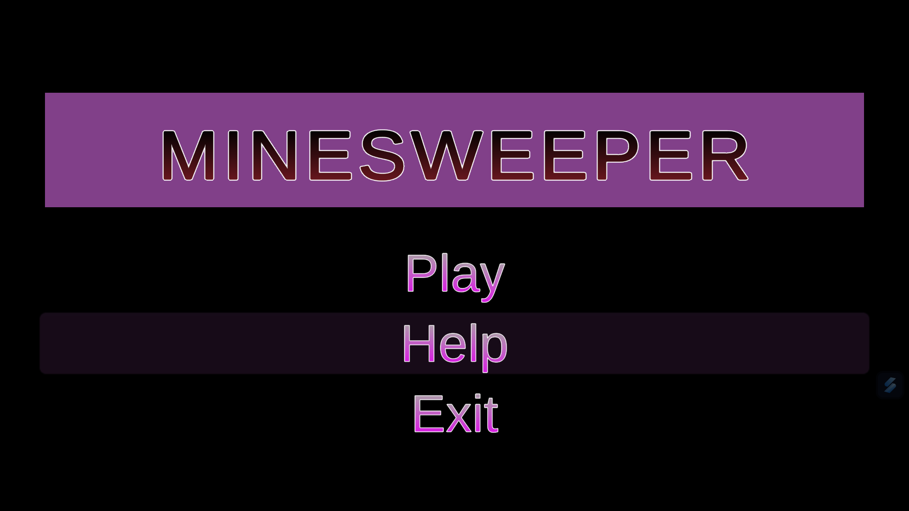
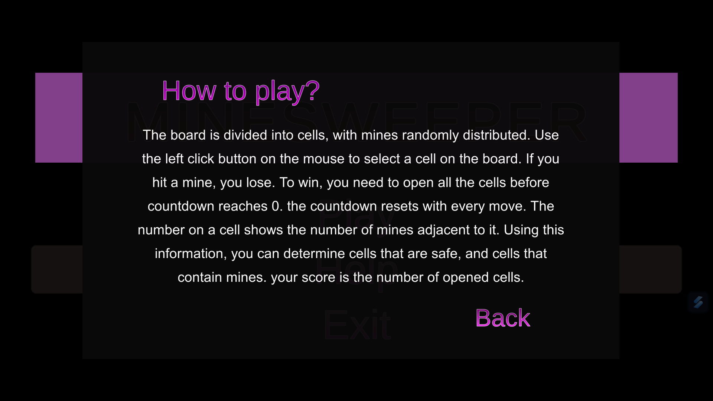
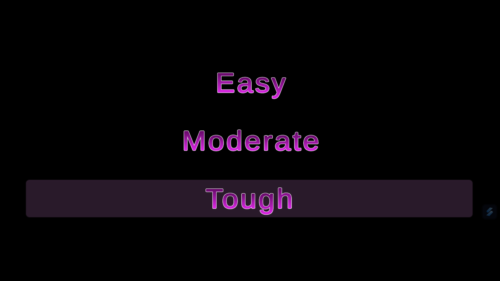
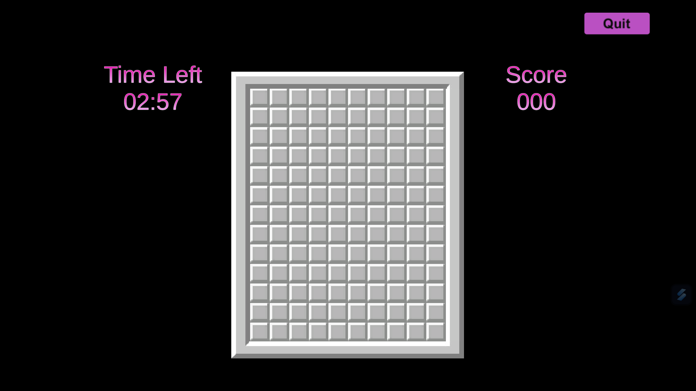
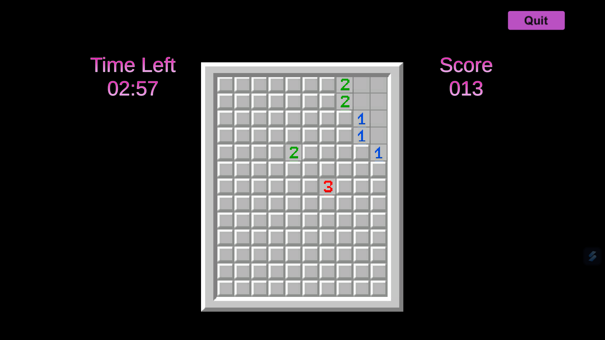
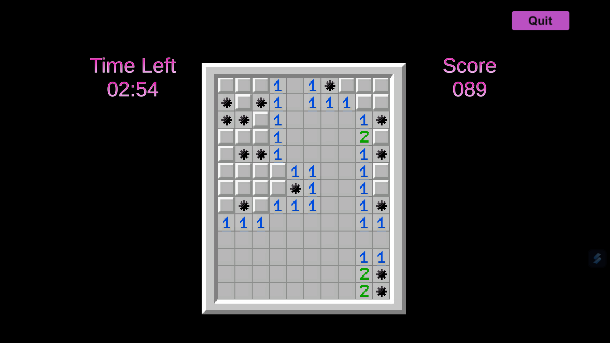
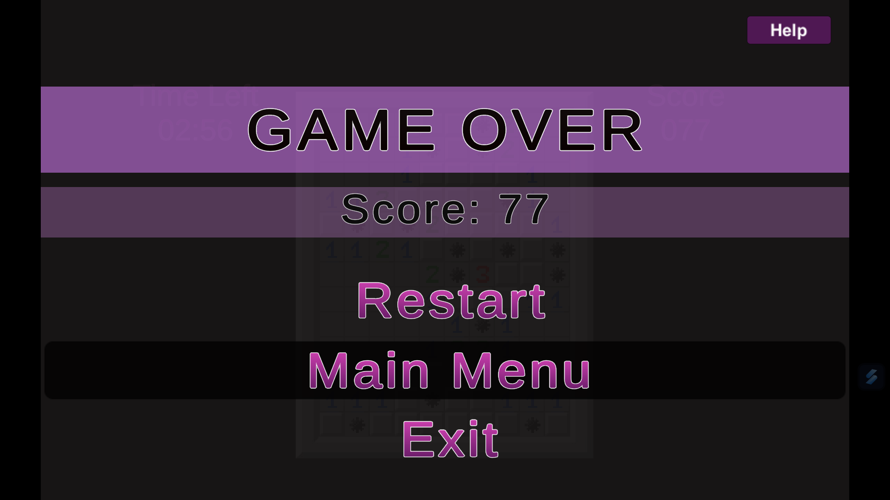

# MineBlaster - Unity

## Overview

Welcome to MineBlaster, an exciting Unity-based Minesweeper game coded in C#. Unearth the mines while avoiding explosions to clear the grid. Use your logical thinking and strategy to conquer different levels. Watch out for hidden mines, mark them, and aim for the best score!

## Contents

- **codes:** Contains all the code files required for the game. All cs files are in codes/Assests/Scripts:
  - `CountDownScript.cs`: Manages the countdown before the game starts.
  - `Element.cs`: Defines the behavior of each grid element.
  - `GameEndScript.cs`: Handles the game end scenario and.
  - `GridScript.cs`: Manages the creation and interaction with the game grid.
  - `LevelScript.cs`: Controls the different game levels.
  - `mainMenuScript.cs`: Implements the main menu functionality.
  - `ScoreScript.cs`: Tracks and updates the player's score.

- **build:** Contains the executable application and necessary files to run the game.

---

## How to Run

Follow the steps below to run the MineBlaster game:

1. **Clone the Repository:**
   ```
   git clone https://github.com/manisha-v/Mineblaster.git
   cd Mineblaster
   ```

2. **Open Unity:**
   - Open Unity Hub and add the project by selecting the cloned folder.

3. **Run the Game:**
   - Open the main scene.
   - Press the play button in the Unity Editor to run the game.

4. **Or just Run the Executable:**
   - Navigate to the `build` folder.
   - Run the provided executable file (`Minesweeper.exe`) to play the game.

5. **Enjoy:**
   - Use your logical thinking to uncover mines without triggering explosions.
   - Mark potential mine locations and complete the grid.

## Preview

Main Menu - Play - Start the game, Help - how to play, and Exit.



Help Option



Play - On clicking we get the different levels. Choose accordingly



Game in Action - Unearth the mines without triggering explosions.



(for each move you have 3 minutes)

Game Over - Your final score and performance are displayed.




**Have fun playing MineBlaster! ⛏️**

## Need any help?

Connect with me on [LinkedIn](https://www.linkedin.com/in/your-linkedin-profile/)   

Thank you for exploring our MineBlaster game! If you have any questions or feedback, please don't hesitate to reach out.
